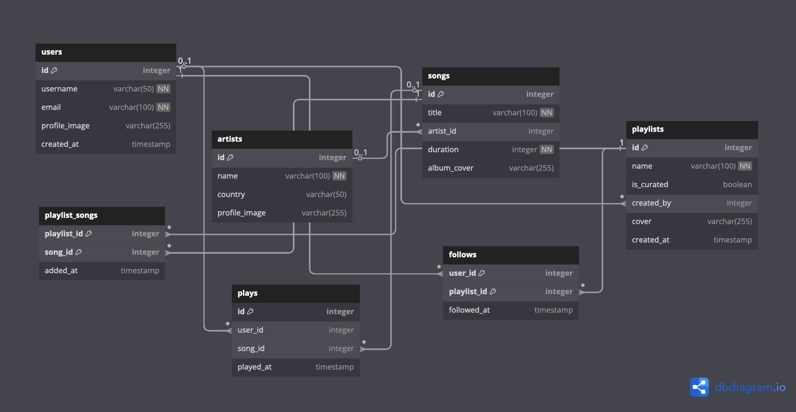

# Music Streaming Service - Database Course Project

This database models a comprehensive music streaming platform that tracks user interactions, music content, and social engagement patterns. It manages key elements such as users, artists, songs, playlists, listening behavior, and social connections within a music discovery ecosystem.

Each user maintains a profile with authentication credentials and can create multiple playlists containing curated song collections. Users engage with the platform by playing songs (tracked for analytics), following playlists created by others, and building their personal music libraries. The system tracks detailed listening patterns, including play timestamps and user preferences, enabling sophisticated recommendation algorithms and usage analytics.

Specific music content is organized through artist-song relationships, where each song belongs to one artist but can appear in multiple playlists. The platform supports both user-generated and curated playlists, with social features allowing users to discover and follow collections created by others. Play tracking enables the system to generate insights about popular content, user engagement patterns, and temporal listening trends.

## Entities

**users**: Registered platform users with authentication credentials, profile customization, and account creation timestamps.

**artists**: Music creators and performers with identifying information, country of origin, and profile imagery.

**songs**: Core music content with metadata including title, duration, album artwork, and artist attribution.

**playlists**: User-created or platform-curated song collections with naming, cover imagery, and creation tracking.

**playlist_songs**: Junction table mapping songs to playlists with timestamp tracking for playlist composition history.

**plays**: User listening activity records capturing song consumption patterns with precise timestamp data.

**follows**: Social relationship mapping between users and playlists they choose to follow for content discovery.

## Scenarios

- Recording new user registrations and profile management including authentication and personalization.
- Tracking comprehensive listening behavior including song plays, duration, and temporal patterns.
- Managing playlist creation, modification, and social sharing across the user community.
- Storing and analyzing user engagement patterns including follows, plays, and content discovery paths.
- Efficient querying of music catalogs, user histories, playlist compositions, and social network relationships.
- Generating analytics on popular content, user preferences, and platform engagement metrics.

## Data Integrity & Performance

Data integrity is enforced through comprehensive foreign key relationships, unique constraints (preventing duplicate usernames and emails), and temporal consistency checks. Strategic indexing optimizes performance for frequent query patterns including:

- **Play Analytics**: Indexes on `plays(song_id)`, `plays(user_id)`, and `plays(played_at)` for efficient listening pattern analysis
- **Social Features**: Indexes on `follows(playlist_id)` and `follows(user_id)` for rapid social network traversal
- **Content Discovery**: Indexes on `songs(title)`, `artists(name)` for fast search capabilities
- **Playlist Management**: Indexes on `playlists(created_by)` and `playlist_songs(playlist_id)` for efficient collection operations

The system implements composite indexes for complex queries, partial indexes for specific use cases, and optimized join strategies for multi-table operations. Query performance is enhanced through strategic aggregation patterns and efficient GROUP BY operations for analytics workloads.

## Technical Implementation

**Backend**: Flask (Python) with PostgreSQL database hosted on Supabase, utilizing raw SQL queries for optimal performance and precise control over database operations.

**Frontend**: Native Android application built with Kotlin, implementing MVVM architecture with Repository pattern, Retrofit for API communication, and modern Jetpack Compose UI framework.

**Data Generation**: Sophisticated fake data generation using Faker library, creating realistic datasets with 15 users, 13 artists, 50 songs, 16 playlists, and comprehensive relationship data distributed across realistic temporal patterns.

**API Design**: RESTful endpoints supporting full CRUD operations for all entities, with specialized endpoints for analytics, social features, and content discovery optimized for mobile application requirements.
