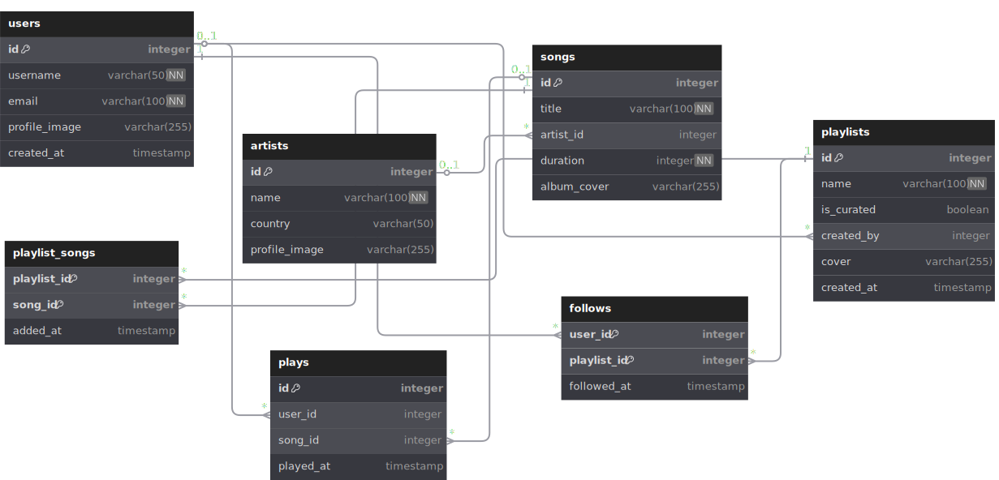

# Music Streaming Service - Database Course Project

This database models a music streaming analytics platform that focuses on data management, user behavior tracking, and content organization rather than actual music playback functionality. 
The system serves as a comprehensive backend for analyzing music consumption patterns and managing digital music catalogs.

## Entities

**users** : Platform members with secure login credentials, customizable profile settings, and registration timestamps for account lifecycle tracking.

**artists** : Musical performers and content creators featuring biographical details, geographic origin data, and visual branding assets.

**songs** : Digital audio tracks containing comprehensive metadata such as titles, playback duration, cover art, and creator associations.

**playlists** : Organized music collections supporting both community-generated and editorial curation with custom titles, visual covers, and creation monitoring.

**playlist_songs** : Relational mapping structure connecting individual tracks to collections while maintaining chronological addition records.

**plays** : Comprehensive listening event logs documenting user engagement patterns through detailed temporal interaction data.

**follows** : Social connection framework linking users to preferred playlists for personalized content discovery and recommendation systems.

## Scenarios

- Recording new user registrations and profile management including authentication and personalization.
- Tracking comprehensive listening behavior including song plays, duration, and temporal patterns.
- Managing playlist creation, modification, and social sharing across the user community.
- Storing and analyzing user engagement patterns including follows, plays, and content discovery paths.
- Efficient querying of music catalogs, user histories, playlist compositions, and social network relationships.
- Generating analytics on popular content, user preferences, and platform engagement metrics.

## Data Integrity & Performance

Data integrity is enforced through comprehensive foreign key relationships, unique constraints (preventing duplicate usernames and emails), and temporal consistency checks. Strategic indexing optimizes performance for frequent query patterns including:

- **Play Analytics**: Indexes on `plays(song_id)`, `plays(user_id)`, and `plays(played_at)` for efficient listening pattern analysis
- **Social Features**: Indexes on `follows(playlist_id)` and `follows(user_id)` for rapid social network traversal
- **Content Discovery**: Indexes on `songs(title)`, `artists(name)` for fast search capabilities
- **Playlist Management**: Indexes on `playlists(created_by)` and `playlist_songs(playlist_id)` for efficient collection operations

The system implements composite indexes for complex queries, partial indexes for specific use cases, and optimized join strategies for multi-table operations. Query performance is enhanced through strategic aggregation patterns and efficient GROUP BY operations for analytics workloads.

## Technical Implementation

**Backend**: Flask (Python) with PostgreSQL database hosted on Supabase, utilizing raw SQL queries for optimal performance and precise control over database operations.

**Frontend**: Native Android application built with Kotlin, implementing MVVM architecture with Repository pattern, Retrofit for API communication, and modern Jetpack Compose UI framework.

**Data Generation**: Sophisticated fake data generation using Faker library, creating realistic datasets with 15 users, 13 artists, 50 songs, 16 playlists, and comprehensive relationship data distributed across realistic temporal patterns.

**API Design**: RESTful endpoints supporting full CRUD operations for all entities, with specialized endpoints for analytics, social features, and content discovery optimized for mobile application requirements.
